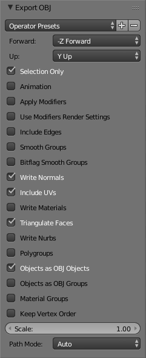

# Computer Graphics seminar
Game and game engine made for Computer Graphics course. 

## Using the game engine
These instructions will help you get started using the engine.

### Models
We use the assimp JSON format for 3D models. 

### Exporting from Blender
If you have a 3d model built with Blender, you can export it to .obj. 

Options to select:




#### Converting the models
You can convert .obj to assimp JSON using  [assimp2json](https://github.com/acgessler/assimp2json). You can use the online
tool or download the Windows binaries. To convert from .obj to assimp JSON using the Windows program, use:
```
assimp2json.exe model.obj model.json
```
ATTENTION: use models that can support only one texture, because the engine does not support multiple textures on one model.
#### Using the models 
After converting the model, you must do a few more steps to render it in your game world:

* Copy the model to the res folder
* Add the model path to modelsPath array in Model.js
* Go to main.js and find function startRender()
* You will see a "Declare" comment, declare your entities there, example: 
```
var treeEntity;
```
* Initialize your entities where the "Initialize" comment is, under the player initialization, example:
```
var playerEntity = new Entity("ball", models["ball"], textures["snow"], [sphereBody.position.x, sphereBody.position.z, sphereBody.position.y]);
playerEntity.setScale([0.3, 0.3, 0.3]);

// Your entity
treeEntity = new Entity("tree", models["tree"], textures["tree"], [0, 0, 0])
```

* Go to "Update entities here" comment and use:
```
treeEntity.update();
treeEntity.draw(shaderProgram);
```
* And your entity will be drawn in the world.

### Textures
You can use your own .png textures in the game.
* Add the .png file in the res folder
* Add the file path to the texturePaths array in Texture.js
* To use the texture with a model, use textures["yourTexture"], example:
```
treeEntity = new Entity("tree", models["tree"], textures["tree"], [0, 0, 0])
```

### Lighting
The engine supports 3 types of lighting:
* Ambient lighting
* Point lighting
* Specular lighting
You can adjust the settings in the constructor of the Light.js script.
Each array represents a color in the RGB format.
```
this.ambientColor = [0.878, 1, 1];
this.pointColor = [0.1, 0.0, 0.1];
this.specularColor = [0.933, 0.510, 0.933];
```
You can change the point light position in the main.js. Search for:
```
light = new Light([0.0, 10000.0, 1000.0]);
```

### Physics
The game engine supports physics using the [cannon.js](https://github.com/schteppe/cannon.js/) library. 
Documentation available [here](http://schteppe.github.io/cannon.js/docs/).
To add physics to your entity, you must create a new "rigid body":
```
var boxBody;

var boxShape = new CANNON.Box(new CANNON.Vec3(0.5, 0.5, 0.3));
boxBody = new CANNON.Body({ mass: 1 });
boxBody.addShape(boxShape);
boxBody.position.set(40, 28, 5);
world.addBody(boxBody);

treeEntity = new Entity("tree", models["tree"], textures["snow"], [boxBody.position.x, boxBody.position.z, boxBody.position.y]);

```

And update entity location every frame
```
// new line
treeEntity.setPosition([boxBody.position.x, boxBody.position.z, boxBody.position.y]);

treeEntity.update();
treeEntity.draw(shaderProgram);
```

#### Infinity mass objects
These are fixed object, other objects cannot change their location. 
To achieve these, set the object mass to zero

```
var boxShape = new CANNON.Box(new CANNON.Vec3(0.5, 0.5, 0.3));
boxBody = new CANNON.Body({ mass: 0 });
boxBody.addShape(boxShape);
boxBody.position.set(40, 28, 0.5);
```
### Built With
* Javascript
* WebGL
* cannon.js

### Credits
* Background music and sounds by PlayOnLoop.com. Licensed under Creative Commons By Attribution 4.0
* Terrain heightmap, ball model and texture by [OneGoldenCat](https://www.youtube.com/channel/UC_7ZpJz9Nr7VnWzbUVIhIeA)
* Arrow, coin, cylinde and portal models by Domen Antlej - [FaksBoi](https://github.com/FaksBoi)

### Authors
* Milos Kostadinovski - [imilosk](https://github.com/imilosk)
* Domen Antlej - [FaksBoi](https://github.com/FaksBoi)

